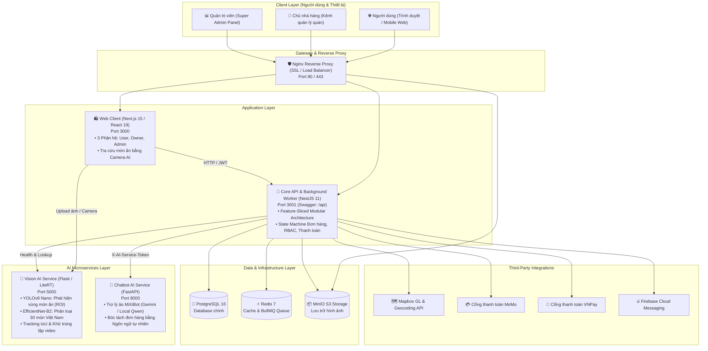

# 🍲 Foodee — Smart Food Delivery & AI Ecosystem

> Hệ sinh thái nền tảng đặt và giao đồ ăn thông minh thế hệ mới, kết hợp **Thị giác máy tính** nhận diện 30 món ăn truyền thống Việt Nam (**YOLOv8 + Google LiteRT**) và **Trợ lý ảo AI** hỗ trợ đặt món bằng ngôn ngữ tự nhiên (**LLM Chatbot**). Hệ thống được tổ chức phân tầng module hóa tối ưu, sẵn sàng vận hành trên môi trường Production.

---

## 🏛️ 1. Sơ đồ Kiến trúc Toàn Hệ thống (System Architecture)



---

## 📦 2. Tổng quan các Phân hệ Dự án

| Phân hệ | Thư mục | Công nghệ chính | Vai trò & Trách nhiệm | Tài liệu chi tiết |
|:---|:---|:---|:---|:---:|
| **Core API & Worker** | [`core-api/`](core-api) | NestJS 11, TypeORM, PostgreSQL 16, Redis 7, BullMQ | Trung tâm nghiệp vụ: Quản lý 14 domain features (Đơn hàng, Thực đơn, Thanh toán, Điều phối Shipper, RBAC, Outbox Pattern) và Background Worker xử lý hàng đợi. | [Xem README](core-api/README.md) |
| **Web Client** | [`web-client/`](web-client) | Next.js 15 (App Router), React 19, Tailwind CSS, Mapbox GL | Giao diện All-in-One cho 3 phân hệ: Khách hàng (đặt món, giỏ hàng gom nhóm), Chủ quán (quản lý menu realtime) và Quản trị viên (dashboard thống kê sàn). | [Xem README](web-client/README.md) |
| **Chatbot Service** | [`chatbot-service/`](chatbot-service) | Python 3.11, FastAPI, Google Gemini / Local Qwen 2.5 | Trợ lý ảo hội thoại MiXiBot: Tư vấn thực đơn thông minh, phân tích câu lệnh đặt món tự nhiên thành dữ liệu giỏ hàng chuẩn xác. | [Xem README](chatbot-service/README.md) |
| **Vision Service** | [`vision-service/`](vision-service) | Python 3.11, Flask, YOLOv8, Google LiteRT (EfficientNet-B2) | Nhận diện & phân loại 30 món ăn Việt Nam từ ảnh/video, tích hợp LRU Cache và thuật toán tracking IoU khử đếm trùng lặp. | [Xem README](vision-service/README.md) |
| **Nginx Proxy** | [`nginx/`](nginx) | Nginx Alpine, OpenSSL | Reverse Proxy điều hướng traffic, SSL termination và bảo vệ an toàn cho các cổng dịch vụ nội bộ. | — |

---

## 🌟 3. Các Điểm Đột Phá Công Nghệ (Core Highlights)

1. **📸 Tìm kiếm Món ăn bằng Camera & Thị giác Máy tính (Two-Stage AI Pipeline):**
   * Người dùng chỉ cần chụp ảnh hoặc quay video món ăn đang thèm.
   * Giai đoạn 1 (**YOLOv8 Nano**) phát hiện vùng thức ăn trong khung hình ➔ Giai đoạn 2 (**EfficientNet-B2 Float16 LiteRT**) phân loại chính xác vào 30 món ăn đặc sản Việt Nam.
   * Kết quả hiển thị bounding box tương tác trực quan và cho phép bấm tìm ngay các quán ngon gần nhất có phục vụ món đó.
2. **🤖 Đặt món bằng Ngôn ngữ Tự nhiên qua Trợ lý ảo AI (Conversational Ordering):**
   * Tích hợp chatbot thông minh hỗ trợ khách hàng không cần lướt thực đơn thủ công.
   * Tự động hiểu câu lệnh phức tạp (ví dụ: *"Cho mình 2 suất bún bò huế ít cay với 1 trà đá"*), đối soát giá/tồn kho và lên đơn hàng từng bước.
3. **🗺️ Định vị Thông minh & Bản đồ Tương tác Mapbox:**
   * Tự động xác định tọa độ GPS của khách hàng, vẽ bản đồ số Mapbox hiển thị nhà hàng và lộ trình tài xế giao hàng.
   * Tính toán khoảng cách địa lý và biểu phí giao hàng chuẩn xác theo thời gian thực.
4. **💳 Thanh toán Trực tuyến Đa kênh An toàn (MoMo & VNPay):**
   * Hỗ trợ cổng thanh toán MoMo và VNPay qua luồng Redirect & QR Code.
   * Cơ chế **Webhook Idempotency** và **Outbox Pattern** đảm bảo không bao giờ bị xử lý trùng lặp giao dịch hoặc thất thoát trạng thái đơn.
5. **⚡ Kiến trúc Module Hóa Cao cấp (Feature-Sliced Architecture):**
   * Backend tổ chức thành 14 domain features độc lập, phân tách rạch ròi qua `public-api.ts`.
   * Background Worker độc lập xử lý hàng đợi BullMQ không làm nghẽn tiến trình API chính.

---

## 🌐 4. Bảng Phân Bổ Cổng Dịch Vụ (Service Port Mapping)

| Dịch vụ | Tên Container | Cổng Host | URL Truy cập Mặc định | Chức năng |
|:---|:---|:---:|:---|:---|
| **Web Client** | `foodee-web-client` | `3000` | [http://localhost:3000](http://localhost:3000) | Giao diện web Khách hàng, Chủ quán và Quản trị viên |
| **Core API** | `foodee-api` | `3001` | [http://localhost:3001/api](http://localhost:3001/api) | HTTP REST API & Tài liệu Swagger UI |
| **Vision AI** | `foodee-vision` | `5000` | [http://localhost:5000/](http://localhost:5000/) | API nhận diện món ăn & Giao diện Web Demo test ảnh/video |
| **Chatbot AI** | `foodee-chatbot` | `8000` | [http://localhost:8000/health](http://localhost:8000/health) | API Trợ lý ảo hội thoại và bóc tách đơn hàng |
| **PostgreSQL** | `foodee-postgres` | `5432` | `localhost:5432` | Cơ sở dữ liệu quan hệ PostgreSQL 16 |
| **Redis** | `foodee-redis` | `6379` | `localhost:6379` | Bộ nhớ đệm Cache & Hàng đợi BullMQ |
| **MinIO API** | `foodee-minio` | `9000` | [http://localhost:9000](http://localhost:9000) | S3-compatible Object Storage Endpoint |
| **MinIO Console**| `foodee-minio` | `9001` | [http://localhost:9001](http://localhost:9001) | Bảng điều khiển quản trị file MinIO |
| **Nginx Proxy** | `foodee-nginx` | `80`, `443`| [http://localhost](http://localhost) | Cổng Reverse Proxy toàn hệ thống |

---

## 🚀 5. Hướng dẫn Khởi chạy Toàn Hệ Thống (Quick Start)

Cách nhanh nhất để chạy toàn bộ hệ thống (Database, Redis, MinIO, Core API, Web Client và 2 AI Services) là sử dụng **Docker Compose**:

### Bước 1: Sao chép tệp cấu hình môi trường
```bash
# Tại thư mục gốc của dự án:
cp .env.example .env
```
*(Điền các khóa bí mật như `AI_SERVICE_TOKEN`, `MAPBOX_ACCESS_TOKEN`, Google OAuth hoặc giữ nguyên các giá trị mặc định để chạy thử nghiệm)*

### Bước 2: Khởi chạy toàn bộ Container
```bash
docker compose up --build -d
```

Hệ thống sẽ tự động:
1. Dựng cơ sở dữ liệu **PostgreSQL**, **Redis** và **MinIO Storage**.
2. Chạy container di chuyển dữ liệu (`migrate`) áp dụng **37 migrations** và nạp sẵn dữ liệu mẫu cho hơn 10 nhà hàng, thực đơn, topping và tài khoản admin.
3. Khởi chạy **Core API** (Port 3001) và **Background Worker**.
4. Khởi chạy **Chatbot Service** (Port 8000) và **Vision Service** (Port 5000).
5. Khởi chạy **Web Client** (Port 3000) và **Nginx Reverse Proxy**.

### Bước 3: Kiểm tra trạng thái hệ thống
```bash
# Kiểm tra danh sách container và trạng thái healthcheck:
docker compose ps

# Xem log tổng hợp:
docker compose logs -f
```

---

## 💻 6. Hướng dẫn Phát triển Môi trường Local (Local Development)

Nếu muốn chạy trực tiếp mã nguồn trên máy cá nhân để phát triển và debug:

### 1. Dựng tầng hạ tầng phụ trợ (Database, Redis, MinIO):
```bash
docker compose up -d postgres redis minio
```

### 2. Khởi chạy Core API:
```bash
cd core-api
npm install
npm run migration:run   # Nạp cấu trúc bảng và dữ liệu mẫu
npm run start:dev       # API Server chạy tại http://localhost:3001
```

### 3. Khởi chạy Web Client:
```bash
cd web-client
npm install
npm run dev             # Frontend chạy tại http://localhost:3000
```

### 4. Khởi chạy AI Services:
* **Chatbot Service (FastAPI):**
  ```bash
  cd chatbot-service
  python -m venv venv && venv\Scripts\activate   # Linux/Mac: source venv/bin/activate
  pip install -r requirements.txt
  uvicorn app.main:app --reload --port 8000
  ```
* **Vision Service (Flask):**
  ```bash
  cd vision-service
  python -m venv .venv && .venv\Scripts\activate # Linux/Mac: source .venv/bin/activate
  pip install -r requirements-dev.txt
  flask --app app run --host=0.0.0.0 --port=5000
  ```

---

## 🧪 7. Đảm bảo Chất lượng & Kiểm thử Tự động (Testing)

Dự án sở hữu ma trận kiểm thử tự động toàn diện trên tất cả các phân hệ:

```bash
# 1. Kiểm thử Core API (Jest: Unit, Integration, E2E):
cd core-api
npm run test:unit
npm run test:integration
npm run test:e2e

# 2. Kiểm thử Web Client (10 kịch bản Playwright E2E):
cd web-client
npm run test:e2e

# 3. Kiểm thử Chatbot AI (Pytest & 40 ca benchmark dữ liệu giả định):
cd chatbot-service
python -m pytest evaluation/ -q
python -m evaluation.run_eval --limit 1

# 4. Kiểm thử Vision AI (90+ Pytest cases bao phủ API, Cache, Tracking, Model):
cd vision-service
pytest tests/ -v
```

---

## 📚 8. Danh mục Tài liệu Kỹ thuật Chi tiết

Để tìm hiểu sâu hơn về kiến trúc, cấu hình môi trường và hướng dẫn vận hành cho từng dịch vụ cụ thể, vui lòng tham khảo các tài liệu chuyên sâu tại [**Thư mục Tài liệu (docs/)**](docs/README.md):

### 📖 Tài liệu Thiết kế & Vận hành Hệ thống:
* 🏛️ [Kiến trúc Hệ thống & Luồng Dữ liệu](docs/ARCHITECTURE.md) — Sơ đồ Sequence Diagrams chi tiết về luồng Đặt hàng, Thanh toán, AI Vision và Chatbot LLM.
* 🗄️ [Thiết kế Cơ sở Dữ liệu & ERD](docs/DATABASE_DESIGN.md) — Đặc tả 27 bảng thực thể, 37 migrations, State Machine đơn hàng và Outbox Pattern.
* 🛡️ [Kiến trúc Bảo mật & Phân quyền RBAC](docs/SECURITY_AND_RBAC.md) — Ma trận 5 vai trò, Cookie JWT HttpOnly, chống IDOR/BOLA và chữ ký số Webhook.
* 🧪 [Chiến lược Kiểm thử Toàn diện](docs/TESTING_STRATEGY.md) — Ma trận kiểm thử Jest, 10 kịch bản Playwright E2E, 40 ca benchmark Chatbot và 90+ tests Vision AI.
* 🛠️ [Sổ tay Vận hành & Giám sát](docs/OPERATIONS_RUNBOOK.md) — Ma trận Healthcheck, sao lưu/khôi phục PostgreSQL & MinIO, cẩm nang xử lý sự cố.
* 🚀 [Hướng dẫn Triển khai Production](docs/PRODUCTION_DEPLOYMENT.md) — Sổ tay triển khai thực tế trên Docker Compose Production (`compose.prod.yml`) và SSL Nginx.
* ⚙️ [Hướng dẫn Thiết lập CI/CD](CI_CD_GUIDE.md) — Tài liệu tự động hóa quy trình kiểm thử và tích hợp liên tục.

### 📦 Tài liệu Chi tiết theo Phân hệ:
* 📘 [Tài liệu Kỹ thuật Core API & Worker](core-api/README.md) — Hướng dẫn kiến trúc NestJS, Outbox pattern và BullMQ.
* 📋 [Đặc tả 100+ API Endpoints](core-api/API_DOCUMENTATION.md) — Danh mục toàn diện các route, HTTP method, DTO, permission và role.
* 🌐 [Tài liệu Kỹ thuật Web Client](web-client/README.md) — Hướng dẫn cài đặt Next.js 15, kiến trúc FSD và Cookie JWT.
* 🤖 [Tài liệu Kỹ thuật Chatbot Service (MiXiBot)](chatbot-service/README.md) — Kiến trúc FastAPI, pipeline Agent LLM và function calling.
* 👁️ [Tài liệu Kỹ thuật Vision Service](vision-service/README.md) — Hướng dẫn YOLOv8 + LiteRT classification và tracking IoU.

---

## 📄 9. Bản quyền & Đóng góp (License & Contribution)

* Dự án được xây dựng và phát triển phục vụ mục đích học tập, nghiên cứu và đồ án tốt nghiệp tại Đại học Công nghệ Thông tin (UIT - VNU-HCM).
* Mọi đóng góp, báo lỗi (issue) hoặc đề xuất tính năng mới (pull request) đều được hoan nghênh.
