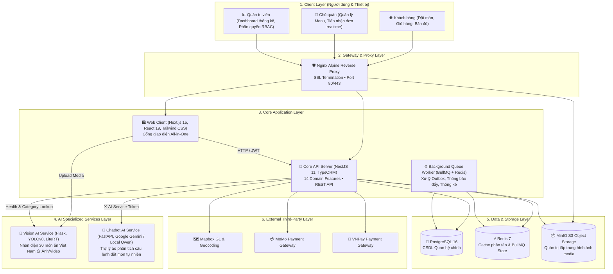
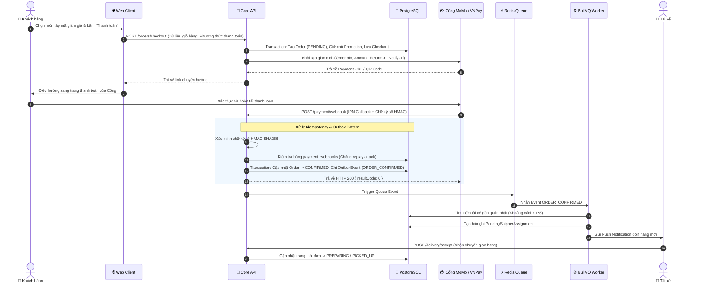
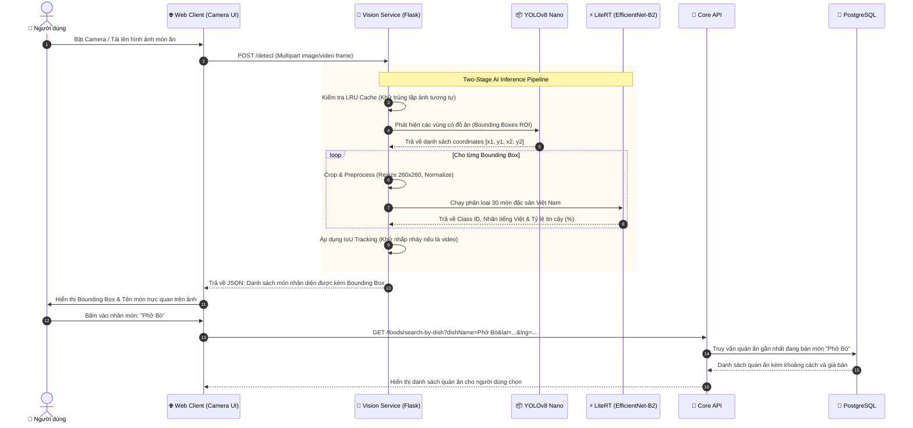
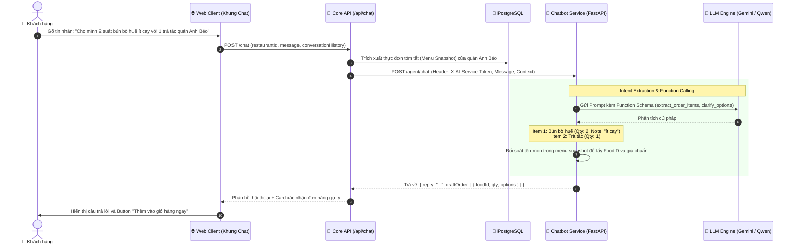

# 🏛️ Tài liệu Thiết kế Kiến trúc Hệ thống (System Architecture)

> Tài liệu này mô tả chi tiết mô hình kiến trúc tổng thể, các luồng dữ liệu nghiệp vụ chính (Sequence Diagrams) và các quy chuẩn thiết kế phần mềm của toàn bộ hệ sinh thái **Foodee**.

---

## 📑 Mục lục
1. [Mô hình Phân tầng Tổng thể](#1-mô-hình-phân-tầng-tổng-thể)
2. [Các Luồng Dữ liệu Nghiệp vụ Chính (Sequence Diagrams)](#2-các-luồng-dữ-liệu-nghiệp-vụ-chính-sequence-diagrams)
   * [2.1. Luồng Đặt món, Thanh toán & Điều phối Giao hàng](#21-luồng-đặt-món-thanh-toán--điều-phối-giao-hàng)
   * [2.2. Luồng Thị giác Máy tính Nhận diện Món ăn (Two-Stage Vision AI)](#22-luồng-thị-giác-máy-tính-nhận-diện-món-ăn-two-stage-vision-ai)
   * [2.3. Luồng Đặt món bằng Ngôn ngữ Tự nhiên qua Trợ lý ảo (MiXiBot LLM)](#23-luồng-đặt-món-bằng-ngôn-ngữ-tự-nhiên-qua-trợ-lý-ảo-mixibot-llm)
3. [Kiến trúc Module Hóa Backend (Feature-Sliced Domain Architecture)](#3-kiến-trúc-module-hóa-backend-feature-sliced-domain-architecture)
4. [Tách biệt Xử lý Đồng bộ (API) và Bất đồng bộ (Queue Worker)](#4-tách-biệt-xử-lý-đồng-bộ-api-và-bất-đồng-bộ-queue-worker)
5. [Quy chuẩn Giao tiếp Liên Dịch vụ (Inter-Service Communication)](#5-quy-chuẩn-giao-tiếp-liên-dịch-vụ-inter-service-communication)

---

## 1. Mô hình Phân tầng Tổng thể

Hệ sinh thái Foodee được tổ chức theo mô hình phân tầng chặt chẽ nhằm tối ưu hóa tính độc lập, khả năng mở rộng quy mô và độ tin cậy:



---

## 2. Các Luồng Dữ liệu Nghiệp vụ Chính (Sequence Diagrams)

### 2.1. Luồng Đặt món, Thanh toán & Điều phối Giao hàng

Luồng đặt hàng kết hợp chặt chẽ giữa **Idempotent Webhook** và **Transactional Outbox Pattern** để đảm bảo không thất thoát dữ liệu và không bao giờ trừ tiền trùng lặp:



---

### 2.2. Luồng Thị giác Máy tính Nhận diện Món ăn (Two-Stage Vision AI)

Quy trình nhận diện sử dụng kết hợp **YOLOv8 Nano** để khoanh vùng (ROI) và **Google LiteRT Float16 (EfficientNet-B2)** để phân loại chính xác 30 món ăn Việt Nam:



---

### 2.3. Luồng Đặt món bằng Ngôn ngữ Tự nhiên qua Trợ lý ảo (MiXiBot LLM)



---

## 3. Kiến trúc Module Hóa Backend (Feature-Sliced Domain Architecture)

Dự án áp dụng chặt chẽ kiến trúc **Feature-Sliced Architecture** trong `core-api/src/features`. Hệ thống bao gồm **14 domain features** độc lập:

```text
core-api/src/features/
├── auth/                 # Xác thực JWT, Google OAuth, Đổi mật khẩu, OTP
├── users/                # Quản lý tài khoản, hồ sơ cá nhân và phân quyền RBAC
├── restaurants/          # Quản lý hồ sơ nhà hàng, giờ mở/đóng cửa, kiểm duyệt quán
├── menu/                 # Thực đơn, danh mục món ăn (Category), món ăn (Food) & Topping
├── orders/               # Máy trạng thái đơn hàng (Order State Machine), giỏ hàng
├── payments/             # Tích hợp MoMo, VNPay, đối soát Webhook Idempotent
├── delivery/             # Quản lý hồ sơ tài xế (Shipper Profile), điều phối chuyến
├── promotions/           # Quản lý voucher, quy tắc giảm giá, kiểm tra điều kiện áp dụng
├── reviews/              # Đánh giá món ăn, chấm điểm phục vụ tài xế
├── communications/       # Trò chuyện tin nhắn trực tiếp giữa Khách - Quán - Tài xế
├── notifications/        # Hệ thống thông báo đẩy (In-app, Firebase)
├── locations/            # Tọa độ địa lý, tính toán khoảng cách Mapbox
├── system-constraints/   # Ràng buộc cấu hình động toàn hệ thống
└── analytics/            # Báo cáo doanh thu, phân tích số liệu sàn thương mại
```

### Quy chuẩn Ranh giới Bắt buộc (Architecture Enforcements):
1. **Giao tiếp qua Public API:** Mọi tương tác xuyên module bắt buộc phải import qua file `public-api.ts` tại thư mục gốc của feature đó (ví dụ: `import { OrdersService } from '@/features/orders/public-api'`).
2. **Quyền sở hữu Thực thể (Entity Ownership):** Mỗi Entity trong CSDL chỉ thuộc quyền sở hữu của duy nhất một Feature. Không một Feature nào được phép ghi trực tiếp vào Entity của Feature khác.
3. **Cấm Phụ thuộc Vòng (`forwardRef`):** Tuyệt đối cấm sử dụng `forwardRef()` trong NestJS Module. Các giao tiếp phụ thuộc vòng phải được tách thành Port/Adapter, Facade hoặc phát sự kiện bất đồng bộ qua Outbox Pattern.

---

## 4. Tách biệt Xử lý Đồng bộ (API) và Bất đồng bộ (Queue Worker)

Hệ thống phân tách rạch ròi giữa 2 tiến trình Node.js:

| Đặc điểm | Tiến trình API (`npm run start:dev`) | Tiến trình Worker (`npm run start:worker`) |
|:---|:---|:---|
| **Mục tiêu** | Phản hồi các HTTP request từ người dùng với độ trễ thấp nhất (< 100ms) | Xử lý các tác vụ nền tiêu tốn thời gian mà không gây nghẽn luồng chính |
| **Công nghệ** | NestJS HTTP Server, Fastify/Express engine | BullMQ Processor, Redis Streams / Job Queue |
| **Trách nhiệm** | Tiếp nhận đơn, kiểm tra tính hợp lệ dữ liệu, xác thực thanh toán | Quét bảng Outbox Event, gửi email hóa đơn, gửi thông báo đẩy Firebase, tìm tài xế giao hàng, tổng hợp doanh thu |
| **Khả năng chịu lỗi**| Tự động rollback transaction nếu có lỗi | Hỗ trợ Exponential Backoff Retry (thử lại tối đa 5 lần nếu bên thứ ba gặp sự cố) |

---

## 5. Quy chuẩn Giao tiếp Liên Dịch vụ (Inter-Service Communication)

Để bảo đảm tính an toàn khi các dịch vụ trao đổi dữ liệu với nhau trong môi trường phân tán:

1. **Khách hàng ➔ Core API:** Sử dụng JWT Token lưu trữ an toàn trong Cookie `HttpOnly; SameSite=Lax; Secure`.
2. **Core API ➔ AI Services (Chatbot & Vision):** Sử dụng Header nội bộ bí mật:
   ```http
   X-AI-Service-Token: <AI_SERVICE_TOKEN>
   ```
   Các dịch vụ AI sẽ từ chối mọi yêu cầu không mang token này hoặc token không khớp với cấu hình môi trường.
3. **Cổng Thanh toán ➔ Core API:** Sử dụng mã hóa kiểm tra tính toàn vẹn dữ liệu **HMAC-SHA256**. Mọi Webhook request có chữ ký không hợp lệ sẽ bị từ chối ngay lập tức trước khi phân tích nội dung đơn hàng.
