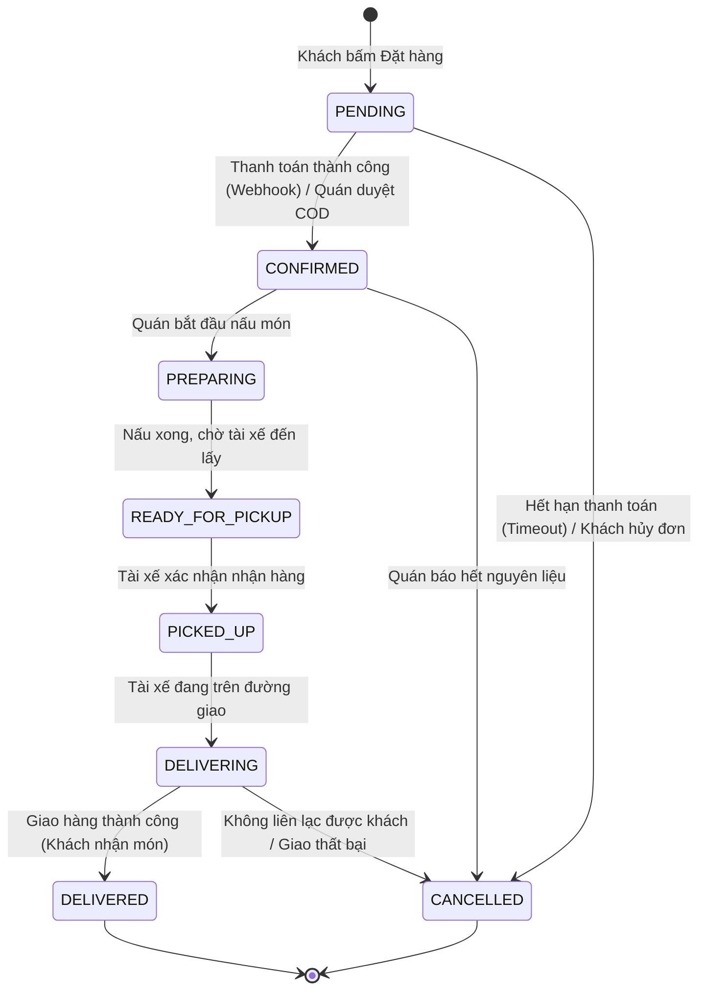

# 🗄️ Thiết kế Cơ sở Dữ liệu & Mô hình Thực thể (Database Design & ERD)

> Tài liệu này mô tả chi tiết kiến trúc cơ sở dữ liệu quan hệ **PostgreSQL 16**, mô hình quan hệ thực thể (ERD), máy trạng thái đơn hàng (Order State Machine), cơ chế Transactional Outbox Pattern và chiến lược tối ưu hóa hiệu năng trong hệ thống **Foodee**.

---

## 📑 Mục lục
1. [Tổng quan Hạ tầng Dữ liệu](#1-tổng-quan-hạ-tầng-dữ-liệu)
2. [Sơ đồ Quan hệ Thực thể Toàn diện (ERD Diagram)](#2-sơ-đồ-quan-hệ-thực-thể-toàn-diện-erd-diagram)
3. [Đặc tả 27 Thực thể CSDL theo Phân hệ](#3-đặc-tả-27-thực-thể-csdl-theo-phân-hệ)
   * [3.1. Phân hệ Định danh & Phân quyền (Identity & RBAC)](#31-phân-hệ-định-danh--phân-quyền-identity--rbac)
   * [3.2. Phân hệ Nhà hàng & Thực đơn (Restaurant & Catalog)](#32-phân-hệ-nhà-hàng--thực-đơn-restaurant--catalog)
   * [3.3. Phân hệ Đơn hàng & Thanh toán (Orders & Payments)](#33-phân-hệ-đơn-hàng--thanh-toán-orders--payments)
   * [3.4. Phân hệ Vận hành Tài xế & Giao hàng (Delivery & Shipper)](#34-phân-hệ-vận-hành-tài-xế--giao-hàng-delivery--shipper)
   * [3.5. Phân hệ Khuyến mãi & Đánh giá (Promotions & Reviews)](#35-phân-hệ-khuyến-mãi--đánh-giá-promotions--reviews)
   * [3.6. Phân hệ Hội thoại, Thông báo & Outbox Pattern](#36-phân-hệ-hội-thoại-thông-báo--outbox-pattern)
4. [Máy Trạng thái Đơn hàng (Order State Machine)](#4-máy-trạng-thái-đơn-hàng-order-state-machine)
5. [Cơ chế Transactional Outbox Pattern & Chống Lặp Sự kiện (Idempotency)](#5-cơ-chế-transactional-outbox-pattern--chống-lặp-sự-kiện-idempotency)
6. [Chiến lược Đánh Chỉ mục (Indexing Strategy) & Tối ưu Hiệu năng](#6-chiến-lược-đánh-chỉ-mục-indexing-strategy--tối-ưu-hiệu-năng)

---

## 1. Tổng quan Hạ tầng Dữ liệu

* **Hệ quản trị CSDL:** PostgreSQL 16
* **Mã hóa ký tự:** `UTF-8`
* **Tiện ích mở rộng (Extensions):**
  * `uuid-ossp`: Hỗ trợ tự động sinh khóa chính UUIDv4 chuẩn quốc tế.
  * `unaccent`: Hỗ trợ tìm kiếm tiếng Việt không dấu (tìm *"Bún bò"* khi gõ *"bun bo"*).
* **Quản trị ORM & Migration:** TypeORM 0.3 với **37 tập tin migrations** có kiểm soát phiên bản độc lập.

---

## 2. Sơ đồ Quan hệ Thực thể Toàn diện (ERD Diagram)

```mermaid
erDiagram
    %% Identity & RBAC
    USERS ||--o{ ADDRESSES : "sở hữu"
    USERS }o--o{ ROLES : "gán vai trò"
    ROLES }o--o{ PERMISSIONS : "chứa quyền hạn"
    
    %% Restaurant & Menu
    USERS ||--o| RESTAURANTS : "sở hữu quán"
    RESTAURANTS ||--o{ RESTAURANT_APPROVAL_AUDITS : "lịch sử duyệt"
    RESTAURANTS ||--o{ CATEGORIES : "có danh mục"
    CATEGORIES ||--o{ FOODS : "chứa món ăn"
    FOODS ||--o{ TOPPINGS : "có các topping"

    %% Orders & Fulfillment
    USERS ||--o{ ORDERS : "đặt đơn"
    RESTAURANTS ||--o{ ORDERS : "nhận đơn"
    ORDERS ||--|{ ORDER_DETAILS : "chi tiết món"
    FOODS ||--o{ ORDER_DETAILS : "được đặt"
    ORDERS ||--|| SHIPPING_DETAILS : "thông tin giao hàng"
    ORDERS ||--o| CHECKOUTS : "phiên thanh toán"

    %% Promotions
    PROMOTIONS ||--o{ PROMOTION_REDEMPTIONS : "lịch sử áp dụng"
    USERS ||--o{ PROMOTION_REDEMPTIONS : "đã dùng voucher"
    ORDERS ||--o{ PROMOTION_REDEMPTIONS : "được giảm giá"

    %% Delivery & Shipper
    USERS ||--o| SHIPPER_PROFILES : "hồ sơ tài xế"
    SHIPPER_PROFILES ||--o| SHIPPER_CERTIFICATE_INFOS : "chứng chỉ giấy tờ"
    ORDERS ||--o{ PENDING_SHIPPER_ASSIGNMENTS : "điều phối tài xế"
    SHIPPER_PROFILES ||--o{ PENDING_SHIPPER_ASSIGNMENTS : "được đề xuất nhận"
    SHIPPER_PROFILES ||--o{ DELIVERY_EARNINGS_EVENTS : "sự kiện thu nhập"
    ORDERS ||--o{ DELIVERY_EARNINGS_EVENTS : "phát sinh thu nhập"

    %% Reviews
    ORDERS ||--o| REVIEWS : "được đánh giá"
    USERS ||--o{ REVIEWS : "viết đánh giá"
    FOODS ||--o{ REVIEWS : "nhận đánh giá"

    %% Communications & Notifications
    USERS ||--o{ CONVERSATIONS : "tham gia chat"
    CONVERSATIONS ||--o{ MESSAGES : "chứa tin nhắn"
    USERS ||--o{ NOTIFICATIONS : "nhận thông báo"
    NOTIFICATIONS ||--o{ NOTIFICATION_DEAD_LETTERS : "lưu thông báo lỗi"

    %% Distributed State & Resilience
    ORDERS ||--o{ OUTBOX_EVENTS : "phát sự kiện"
    ORDERS ||--o{ ANALYTICS_ORDER_METRICS : "thống kê đo lường"
```

---

## 3. Đặc tả 27 Thực thể CSDL theo Phân hệ

### 3.1. Phân hệ Định danh & Phân quyền (Identity & RBAC)

1. **`User` (`users`):** Lưu trữ thông tin tài khoản người dùng, email, mật khẩu băm bcrypt, số điện thoại, avatar MinIO, trạng thái kích hoạt (`isActive`, `isBlocked`) và phương thức đăng ký (Local / Google OAuth).
2. **`Role` (`roles`):** Bảng vai trò hệ thống (`super_admin`, `administrator`, `restaurant_owner`, `shipper`, `customer`).
3. **`Permission` (`permissions`):** Danh mục quyền hạn chi tiết theo chuẩn `<Resource>.<Action>` (ví dụ: `ORDER.READ`, `MENU.UPDATE`, `SHIPPER.DISPATCH`).
4. **`Address` (`addresses`):** Lưu trữ địa chỉ giao hàng và địa chỉ quán ăn, hỗ trợ tọa độ địa lý `latitude`, `longitude`, cờ `isTemporary` và địa chỉ mặc định.

### 3.2. Phân hệ Nhà hàng & Thực đơn (Restaurant & Catalog)

5. **`Restaurant` (`restaurants`):** Thông tin quán ăn, tên thương hiệu, mô tả, giờ mở/đóng cửa (`openTime`, `closeTime`), bán kính giao hàng, trạng thái kiểm duyệt (`PENDING`, `APPROVED`, `REJECTED`), điểm đánh giá trung bình `rating`.
6. **`RestaurantApprovalAudit` (`restaurant_approval_audits`):** Nhật ký kiểm duyệt nhà hàng của ban quản trị, ghi nhận người duyệt, thời gian duyệt và lý do phê duyệt/từ chối.
7. **`Category` (`categories`):** Danh mục nhóm món ăn thuộc từng quán (Cơm, Bún, Trà sữa, Ăn vặt,...).
8. **`Food` (`foods`):** Món ăn chi tiết, đơn giá, phần trăm giảm giá (`discountPercent`), hình ảnh, số lượng đã bán (`soldCount`), nhãn món ăn thuộc 30 đặc sản Việt Nam.
9. **`Topping` (`toppings`):** Món ăn kèm có tính thêm phí (Ví dụ: Thêm trứng, Thêm trân châu, Thêm phô mai), liên kết trực tiếp với món ăn cha.

### 3.3. Phân hệ Đơn hàng & Thanh toán (Orders & Payments)

10. **`Order` (`orders`):** Bản ghi đơn hàng trung tâm:
    * Mã đơn dạng sinh số ngẫu nhiên hoặc UUID.
    * Trạng thái đơn (`status`), phương thức thanh toán (`COD`, `MOMO`, `VNPAY`).
    * Tổng tiền món (`subtotal`), phí vận chuyển (`deliveryFee`), số tiền được giảm (`discountAmount`), tổng tiền thực thu (`finalAmount`).
11. **`OrderDetail` (`order_details`):** Danh sách món ăn trong đơn, lưu lại **Snapshot bất biến** của tên món, đơn giá tại thời điểm đặt và danh sách Topping kèm theo (tránh tình trạng quán đổi giá làm sai lệch lịch sử đơn cũ).
12. **`ShippingDetail` (`shipping_details`):** Thông tin người nhận, số điện thoại liên lạc, địa chỉ giao hàng cụ thể, tọa độ đích, khoảng cách tính toán và ghi chú cho tài xế.
13. **`Checkout` (`checkouts`):** Phiên thanh toán trực tuyến, lưu mã giao dịch cổng thanh toán (`transactionId`), mã đối soát (`partnerCode`), trạng thái phản hồi IPN và hạn thời gian thanh toán.

### 3.4. Phân hệ Vận hành Tài xế & Giao hàng (Delivery & Shipper)

14. **`ShipperProfile` (`shipper_profiles`):** Hồ sơ hoạt động tài xế, loại phương tiện, biển số xe, tọa độ vị trí GPS mới nhất, trạng thái sẵn sàng nhận đơn (`isAvailable`), điểm uy tín và tỷ lệ hoàn thành cuốc.
15. **`ShipperCertificateInfo` (`shipper_certificate_infos`):** Giấy phép lái xe, căn cước công dân và các chứng chỉ xác minh danh tính.
16. **`PendingShipperAssignment` (`pending_shipper_assignments`):** Hàng đợi điều phối tài xế, ghi nhận các tài xế được hệ thống bắn đơn theo bán kính, có cơ chế hết hạn phản hồi (Timeout) để tự động chuyển tài xế tiếp theo.
17. **`DeliveryEarningsEvent` (`delivery_earnings_events`):** Bản ghi chi tiết tiền công của tài xế trên từng cuốc giao thành công phục vụ đối soát và rút tiền.

### 3.5. Phân hệ Khuyến mãi & Đánh giá (Promotions & Reviews)

18. **`Promotion` (`promotions`):** Mã voucher khuyến mãi, tỷ lệ giảm (%) hoặc số tiền cố định, giá trị đơn hàng tối thiểu, ngân sách tối đa và khoảng thời gian hiệu lực (`startDate`, `endDate`).
19. **`PromotionRedemption` (`promotion_redemptions`):** Bảng kiểm soát số lần sử dụng voucher theo từng tài khoản, đảm bảo chống lạm dụng mã khuyến mãi.
20. **`Review` (`reviews`):** Đánh giá sao (1-5 sao) và nhận xét của khách hàng đối với món ăn và chất lượng giao hàng của tài xế sau khi hoàn thành đơn. Có ràng buộc duy nhất: Một đơn hàng chỉ được đánh giá một lần.

### 3.6. Phân hệ Hội thoại, Thông báo & Outbox Pattern

21. **`Conversation` (`conversations`):** Phòng trò chuyện trực tiếp giữa Khách hàng - Chủ quán hoặc Khách hàng - Tài xế.
22. **`Message` (`messages`):** Nội dung tin nhắn văn bản hoặc hình ảnh trao đổi trong cuộc hội thoại.
23. **`Notification` (`notifications`):** Thông báo đẩy lưu trong hệ thống cho người dùng (Cập nhật đơn hàng, Khuyến mãi mới).
24. **`NotificationDeadLetter` (`notification_dead_letters`):** Lưu trữ các thông báo gửi thất bại (như lỗi mạng tới Firebase FCM) để tiến trình Worker quét và thử lại sau.
25. **`OutboxEvent` (`outbox_events`):** Bảng lưu các sự kiện nghiệp vụ trong cùng Database Transaction để hiện thực hóa **Transactional Outbox Pattern**.
26. **`AnalyticsOrderMetric` (`analytics_order_metrics`):** Dữ liệu tổng hợp (Rollup metrics) theo giờ/ngày phục vụ báo cáo doanh thu và bảng điều khiển trực quan mà không cần chạy query nặng trên bảng `orders`.
27. **`SystemConstraints` (`system_constraints`):** Các tham số ràng buộc toàn sàn được cấu hình động (Phí sàn tối thiểu, Bán kính giao hàng tối đa, Giới hạn thời gian hủy đơn).

---

## 4. Máy Trạng thái Đơn hàng (Order State Machine)

Để đảm bảo tính toàn vẹn nghiệp vụ, trạng thái đơn hàng chỉ được chuyển đổi tuần tự theo các bước hợp lệ, không bao giờ được nhảy cóc:

---

## 5. Cơ chế Transactional Outbox Pattern & Chống Lặp Sự kiện (Idempotency)

### 5.1. Transactional Outbox Pattern
Khi có đơn hàng mới hoặc đơn hàng thanh toán thành công, việc cập nhật Database và bắn Message sang Redis Queue nếu thực hiện rời rạc sẽ có nguy cơ: Cập nhật DB thành công nhưng Redis bị mất mạng ➔ Sự kiện bị biến mất vĩnh viễn.

**Giải pháp của Foodee:**
1. Trong cùng một Database Transaction, Core API lưu dữ liệu Đơn hàng đồng thời ghi một bản ghi vào bảng `outbox_events` với trạng thái `status = 'PENDING'`.
2. Tiến trình Background Worker chạy quét bảng `outbox_events` liên tục:
   * Đẩy event vào Redis/BullMQ.
   * Cập nhật trạng thái `outbox_events.status = 'PUBLISHED'`.
   * Nếu có lỗi, tăng `retryCount` và thực hiện lại theo chiến lược Exponential Backoff.

### 5.2. Chống Lặp Sự kiện Thanh toán (Payment Webhook Idempotency)
Cổng thanh toán MoMo/VNPay có thể gọi lại Webhook IPN nhiều lần nếu mạng chậm.
* Bảng thanh toán có Index duy nhất trên cặp `(provider, transaction_id)`.
* Khi Webhook đến, Core API kiểm tra xem `transaction_id` này đã xử lý thành công chưa. Nếu đã xử lý, hệ thống trả ngay mã phản hồi thành công `HTTP 200` mà không thực hiện cộng tiền hay chuyển trạng thái đơn hàng lần thứ hai.

---

## 6. Chiến lược Đánh Chỉ mục (Indexing Strategy) & Tối ưu Hiệu năng

Để đảm bảo các truy vấn phản hồi dưới 50ms ngay cả khi dữ liệu tăng cao:

| Bảng | Tên Cột Đánh Index | Loại Index | Mục đích Tối ưu |
|:---|:---|:---:|:---|
| `users` | `email` | `UNIQUE B-Tree` | Đăng nhập tức thời, chống trùng tài khoản |
| `restaurants` | `(latitude, longitude)` | `B-Tree Composite` | Tính toán khoảng cách & tìm quán gần khách nhanh chóng |
| `foods` | `restaurant_id`, `category_id` | `B-Tree` | Tải thực đơn nhà hàng không bị quét toàn bảng |
| `orders` | `(user_id, created_at DESC)` | `B-Tree Composite` | Xem lịch sử đơn hàng của khách hàng theo thứ tự mới nhất |
| `orders` | `(restaurant_id, status)` | `B-Tree Composite` | Bảng điều khiển nhận đơn theo thời gian thực của Quán |
| `outbox_events` | `(status, created_at)` | `B-Tree Partial` | Background Worker quét nhanh các sự kiện PENDING chưa xử lý |
| `checkouts` | `(provider, transaction_id)` | `UNIQUE B-Tree` | Đảm bảo tính Idempotency của Webhook thanh toán |
