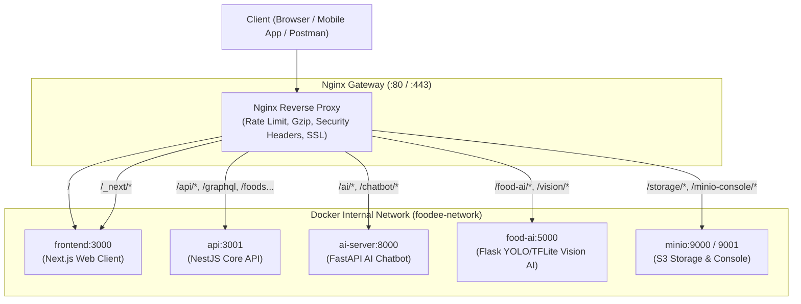

# 🌐 Foodee Nginx Reverse Proxy & API Gateway

Thư mục này chứa toàn bộ cấu hình **Nginx Reverse Proxy & API Gateway** cho nền tảng Foodee, đóng vai trò là điểm tiếp nhận duy nhất (Single Entry Point) cho toàn bộ lưu lượng HTTP/HTTPS, định tuyến thông minh đến các microservices nội bộ, tối ưu hóa bộ nhớ đệm, nén Gzip, bảo vệ chống brute-force và hỗ trợ WebSocket hai chiều.

---

## 🏗️ 1. Sơ đồ Kiến trúc Định tuyến



---

## 🗺️ 2. Bảng Định tuyến Chi tiết (Routing Table)

| Đường dẫn (Path) | Dịch vụ đích (Upstream) | Tính năng đặc biệt |
| :--- | :--- | :--- |
| `/healthz` | Nginx Internal | Trả về `200 OK` tức thì cho load balancer / Docker probe |
| `/` | `frontend:3000` (Next.js) | Giao diện web khách hàng & quản trị |
| `/_next/static/*` | `frontend:3000` | Bộ nhớ đệm tĩnh 1 năm (`max-age=31536000, immutable`) |
| `/_next/image` | `frontend:3000` | Tối ưu hóa ảnh Next.js Image Optimization |
| `/api/docs` | `api:3001/api` | Swagger Documentation |
| `/api/*` | `api:3001` (Core API) | Tự động rewrite bỏ prefix `/api` để gọi API NestJS |
| `/graphql` | `api:3001` (GraphQL) | **Hỗ trợ WebSocket Subscriptions** (`Upgrade`, timeout 24h) |
| `/auth/*` | `api:3001` (Auth) | **Rate limit 5 req/s** chống brute-force đăng nhập/OTP |
| `/foods`, `/orders`, ... | `api:3001` (Features) | Định tuyến trực tiếp theo tên feature chuẩn |
| `/ai/*`, `/chatbot/*` | `ai-server:8000` | Microservice tư vấn món ăn và gợi ý thông minh |
| `/food-ai/*`, `/vision/*` | `food-ai:5000` | Nhận diện món ăn YOLO/TFLite (upload tới 100MB, timeout 300s) |
| `/storage/*` | `minio:9000` | Tải và xem ảnh món ăn, avatar, chứng chỉ MinIO S3 |
| `/minio-console/*` | `minio:9001` | Giao diện quản trị MinIO Web Console |

---

## 🛡️ 3. Các Tính năng Nổi bật

### 3.1. Chống Tấn công & Giới hạn Tần suất (Rate Limiting)
- `api_limit`: Tối đa 30 requests/giây cho các endpoint thông thường, cho phép burst 50.
- `auth_limit`: Tối đa 5 requests/giây cho `/auth/*` (đăng nhập, đăng ký, quên mật khẩu) nhằm ngăn chặn vét cạn mật khẩu.
- `ai_limit`: Tối đa 10 requests/giây cho các tác vụ AI xử lý hình ảnh và video nặng.

### 3.2. Nén Dữ liệu Gzip Tự động
Tự động nén các phản hồi dạng JSON, HTML, CSS, JavaScript, SVG giúp giảm từ **70% - 80% dung lượng truyền tải mạng**.

### 3.3. Bảo mật HTTP Headers
- `X-Frame-Options: SAMEORIGIN` (Chống Clickjacking)
- `X-Content-Type-Options: nosniff` (Chống MIME-sniffing)
- `X-XSS-Protection: 1; mode=block` (Chống Cross-Site Scripting)
- `Referrer-Policy: strict-origin-when-cross-origin`

---

## 🚀 4. Hướng dẫn Sử dụng

### 4.1. Khởi chạy cùng Docker Compose

Nginx đã được tích hợp sẵn vào file `docker-compose.yml` ở gốc dự án:

```bash
docker compose up -d nginx
```

Sau khi khởi chạy:
- Truy cập Web: `http://localhost/`
- Gọi Core API: `http://localhost/api/foods` hoặc `http://localhost/foods`
- Xem Swagger: `http://localhost/api/docs`
- Kiểm tra sức khỏe: `http://localhost/healthz`

### 4.2. Kiểm tra Cú pháp Cấu hình

Khi chỉnh sửa bất kỳ file `.conf` nào, kiểm tra cú pháp bằng lệnh:

```bash
docker compose exec nginx nginx -t
```

Nếu cấu hình hợp lệ (`syntax is ok`), reload Nginx mà không gây gián đoạn dịch vụ:

```bash
docker compose exec nginx nginx -s reload
```

---

## 🔒 5. Triển khai SSL / HTTPS trên Production

Để triển khai chứng chỉ SSL thật bằng Let's Encrypt / Certbot:

1. Đổi tên file `conf.d/production.conf.example` thành `conf.d/production.conf`.
2. Thay thế `foodee.vn` bằng tên miền chính thức của bạn (ví dụ: `yourdomain.com`).
3. Cài đặt Certbot và lấy chứng chỉ:
   ```bash
   certbot certonly --webroot -w /var/www/certbot -d foodee.vn -d www.foodee.vn -d api.foodee.vn
   ```
4. Reload Nginx để kích hoạt HTTPS.
